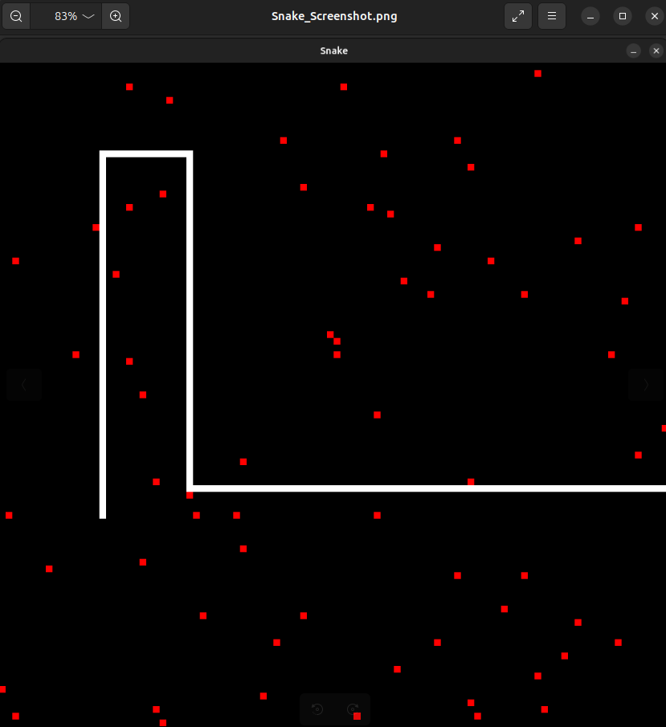

# Snake
C++ game
SDL2

## Description
This project is a simple implementation of the classic Snake game using SDL2 in C++. The game involves controlling a snake to eat randomly placed apples on a grid while avoiding collisions with the snake's own body. The snake grows in length with each apple eaten, and the game ends if the snake collides with itself. The project demonstrates basic game development concepts such as rendering, event handling, collision detection, and dynamic memory management using data structures like deque and vector.



## Compile
```
g++ snake.cpp -lSDL2 -std=c++20 -o snake
```

## Execution
```
./snake
```
