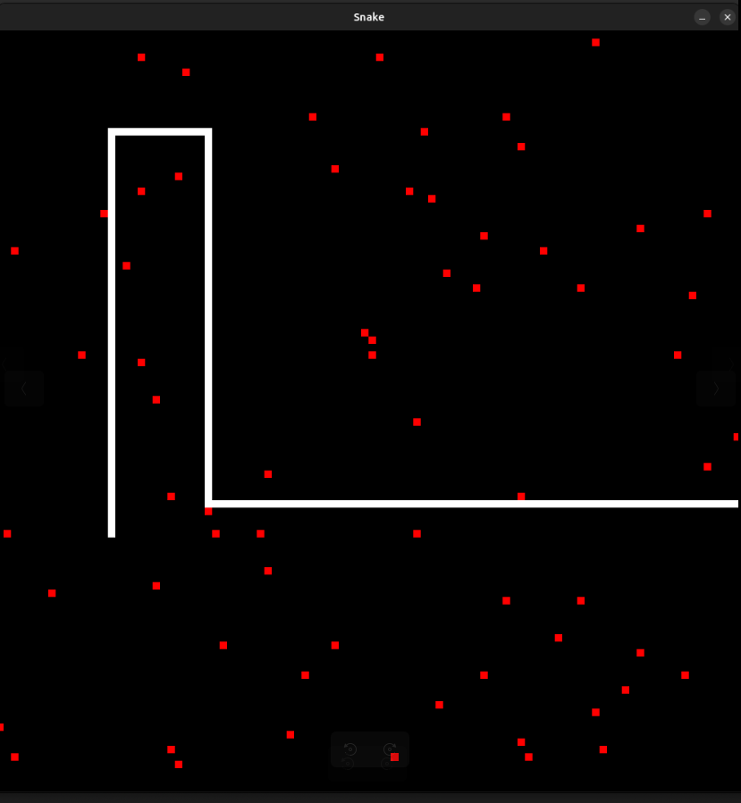

# Snake
C++ game
SDL2

## Compile
```
g++ main.cpp -lSDL2 -std=c++20 -o snake
```

## Execution
```
./snake
```


## Description




This project is a simple implementation of the classic Snake game using SDL2 in C++. The game involves controlling a snake to eat randomly placed apples on a grid while avoiding collisions with the snake's own body. The snake grows in length with each apple eaten, and the game ends if the snake collides with itself. The project demonstrates basic game development concepts such as rendering, event handling, collision detection, and dynamic memory management using data structures like deque and vector.


### Game class

The Game class serves as the central controller for the Snake game. It initializes the SDL environment, manages the game loop, and coordinates interactions between the Snake and the Apples. The Game class is responsible for handling user input, updating the game state, and rendering the game elements on the screen.

### Snake Class
The Snake class manages the state and behavior of the snake in the game. It handles the snake’s movement, growth when an apple is eaten, and self-collision detection. The class maintains the body of the snake as a deque of SDL_Rect structures, representing the position and size of each segment of the snake.

### Apple Class
The Apple class is responsible for managing the apples in the game. It controls the position of each apple and handles the logic for respawning apples in new locations when they are eaten by the snake. The class provides methods to render the apples on the screen and to retrieve their current position.

## To Run the Test:
1 - Install Google Test (`gtest`).
2 - Compile your Snake class and the test file (`SnakeTest.cpp`) together with gtest.
3 - Run the resulting binary to execute the unit tests.
